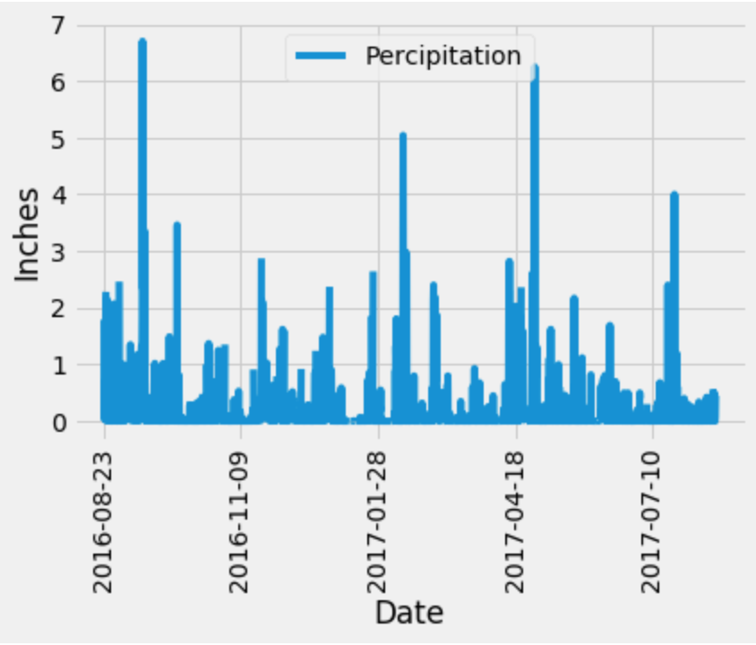
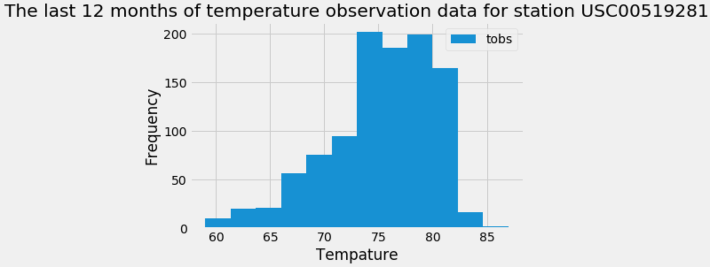

# SQLAlchemy Surfs Up Project

For this project I took a SQLite dataset about Honolulu, Hawaii and with SQLAlchemy in Python ran a climate analysis on it. 

1. First I utilized SQLAlchemy create_engine to connect to the sqlite database.

2. I then used SQLAlchemy automap_base() to reflect my tables into classes and save a reference to those classes called Station and Measurement.

3. I then linked Python to the database by creating an SQLAlchemy session.

**Precipitation Analysis**

1. First I started by finding the most recent date in the data set.

2. Using this date, I then retrieved the last 12 months of precipitation data by querying the 12 preceding months of data. Note you do not pass in the date as a variable to your query.

3. I then narrowed the query results down to just the date and prcp values.

4. I then loaded the query results into a Pandas DataFrame and set the index to the date column and sorted the values by date.

5. I then utilized MatPlotLib to plot the results using the DataFrame plot method.

6. Lastly, I used Pandas to calcualte the summary statistics for the precipitation data

**Exploratory Station Analysis**

1. For this analysis I first designed a query to calculate the total number of stations in the dataset.

2. Next I designed a query to find the most active stations (i.e. which stations have the most rows?). To do this I first listed the stations and observation counts in descending order. Then I calculated which station id has the highest number of observations. Using the most active station id, I then calculated the lowest, highest, and average temperature.

6. Next I designed a query to retrieve the last 12 months of temperature observation data (TOBS) and filter by the station with the highest number of observations. I ploted the results as a histogram.

**Flask API Climate App**

For the next step in this project I designed a Flask API based on the queries that I have just listed above.

I created routes for the app.

1. Home page that lists all the routes avalable

